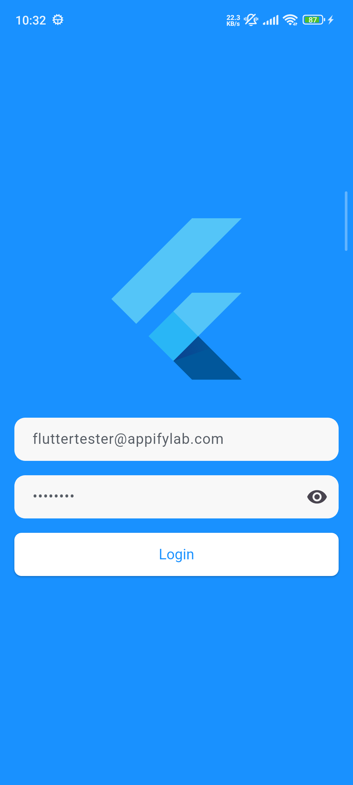
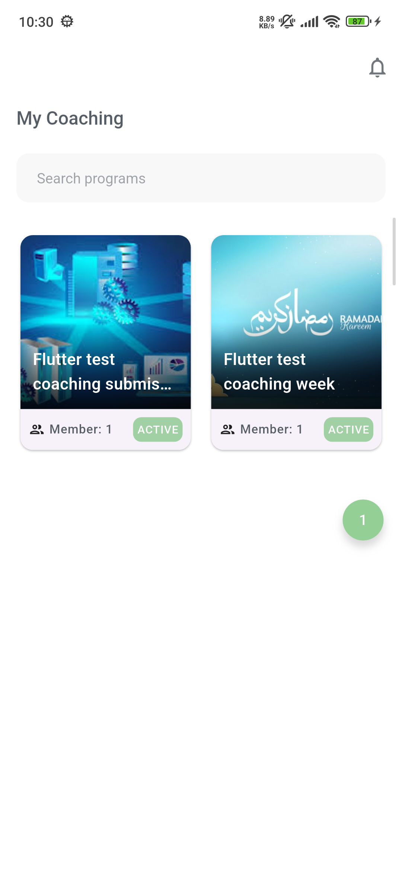
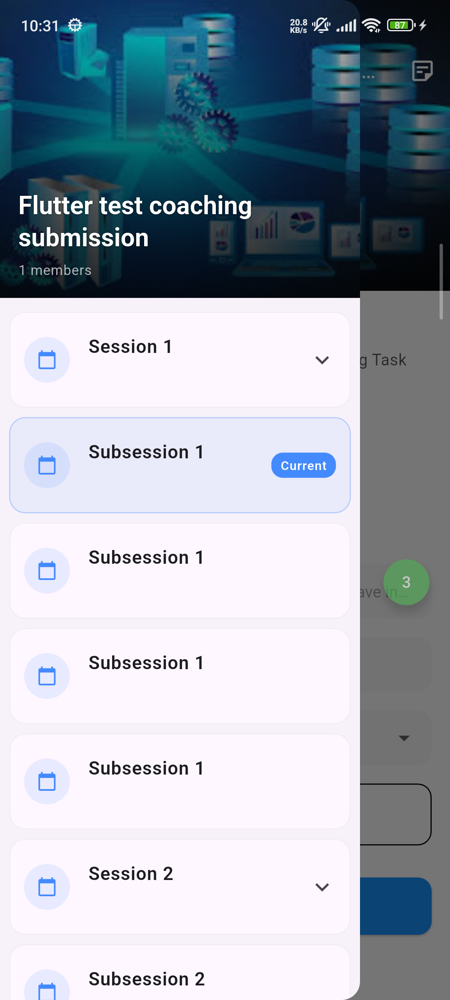
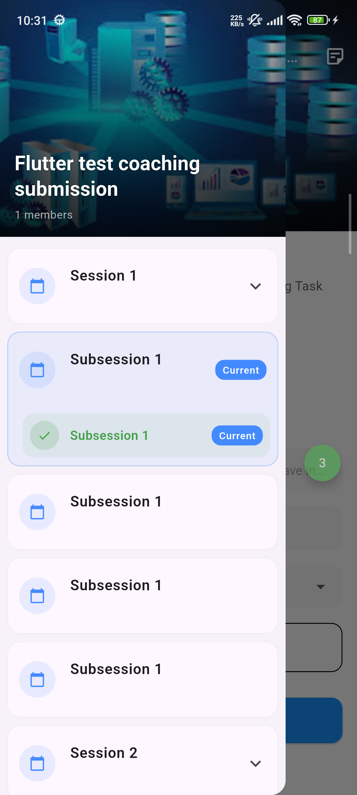
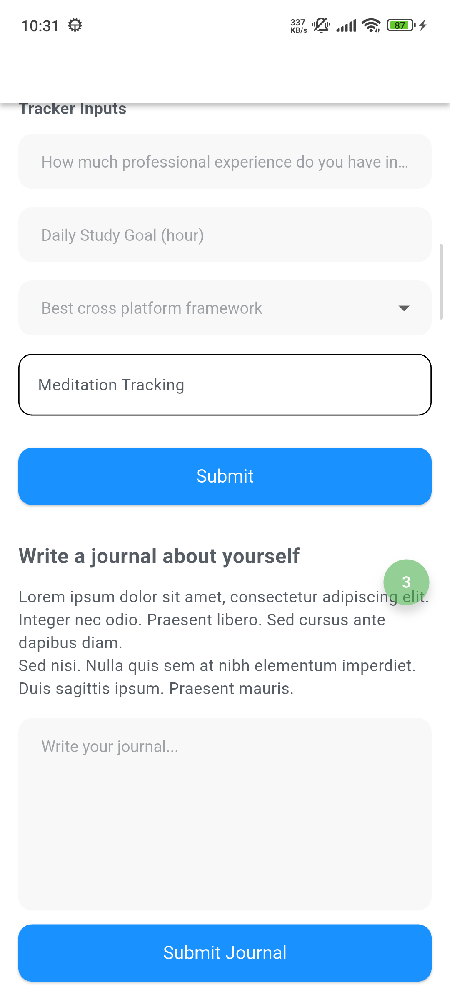
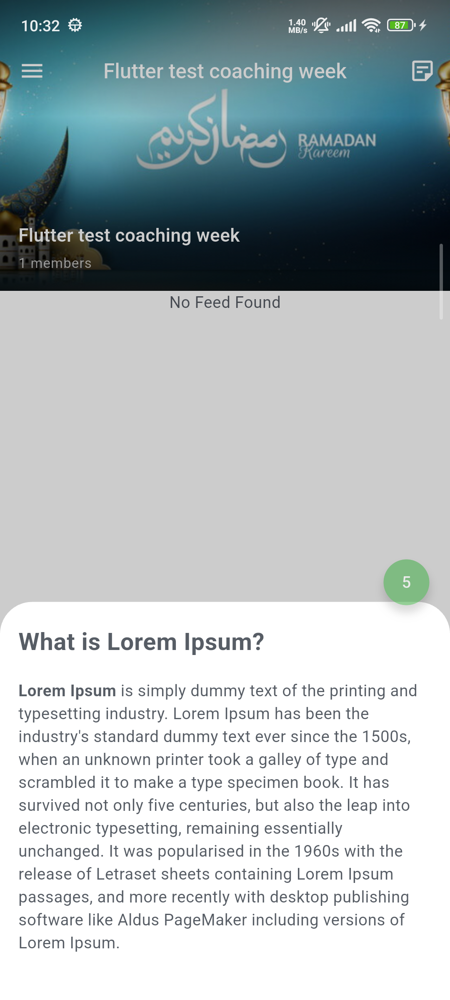
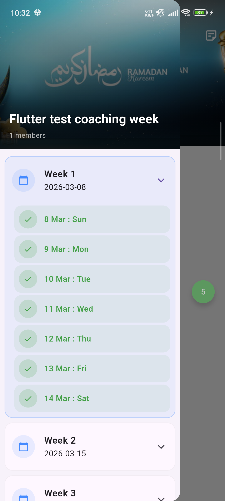

# Coaching Module

# Tech Stack

- Flutter
- Dart
- Flavor Configuration
- Clean Architecture
- Provider
- REST API Integration
- Responsive UI

# Environment Information

| Tool    | Version |
|---------|---------|
| Flutter | 3.41.6  |
| Dart    | 3.11.4  |

# Setup Instructions

## 1. Clone Repository

```bash
git clone https://github.com/shahi5472/Coaching-Module-Test.git
```

---

## 2. Navigate to Project

```bash
cd coaching_module_test
```

---

## 3. Install Dependencies

```bash
flutter pub get
```

---

# Run Using Flavor

## Development

```bash
flutter run --flavor dev -t lib/main.dart
```

---

## Production

```bash
flutter run --flavor prod -t lib/main.dart
```

---

# Build APK

## Dev APK

```bash
flutter build apk --flavor dev -t lib/main.dart
```

---

## Production APK

```bash
flutter build apk --flavor prod -t lib/main.dart
```

# Project Structure

```bash
lib/
│
├── app/                          # App-level config, models, and network layer
│   ├── config/                   # App configuration (base URLs, env settings)
│   ├── model/                    # Shared base models and error types
│   │   └── base/
│   │       ├── base_interfaces/  # Abstract base interfaces
│   │       └── errors/           # Error/failure definitions
│   └── network/                  # Dio setup, interceptors, error handler
│
├── core/                         # Feature modules and shared base layer
│   └── base/
│       ├── controller/           # Base controller / state management
│       ├── services/             # Global datasources, repository, use cases
│       │   ├── global_datasources/
│       │   │   ├── local_datasource/
│       │   │   └── remote_datasource/
│       │   ├── global_repository/
│       │   └── global_usecases/
│       └── widgets/              # Reusable shared widgets
│           ├── buttons/
│           ├── error/
│           ├── fields/
│           ├── image/
│           ├── loader/
│           └── responsive/
│   └── features/                 # Feature modules (one folder per feature)
│       ├── auth/                 # Authentication feature
│       │   ├── login/            # Login screen and controller
│       │   ├── services/         # Auth data layer (params, use cases)
│       │   └── dependencies/     # Auth DI bindings
│       └── coaching_program/     # Coaching program feature
│           ├── data/             # Models, datasource, repository, use cases
│           │   ├── datasource/
│           │   ├── models/
│           │   ├── repository/
│           │   └── usecase/
│           ├── view/             # Screens and view dependencies
│           ├── widgets/          # Feature-specific widgets
│           └── index/            # Feature entry point and DI bindings
│
├── routes/                       # App routing (go_router)
│
├── utils/                        # App-wide utilities and helpers
│   ├── constants/                # Theme, fonts, global constants
│   │   ├── font_utils/
│   │   └── theme/
│   ├── dependency_injection/     # GetIt service locator setup
│   ├── dialog/                   # Dialog helpers
│   └── manager/                  # Runtime managers
│       ├── extensions/           # Dart extensions
│       ├── local_datasource/     # SharedPreferences service
│       └── network/              # Connectivity, NetworkInfo, InternetChangeNotifier
│
├── app.dart                      # Root widget with connectivity listener
├── flavors.dart                  # Flavor definitions (dev / prod)
└── main.dart                     # Entry point
```

## Screenshots

<div align="center">
  
  
  
  
</div>

<div align="center">
  
  
  
  
</div>